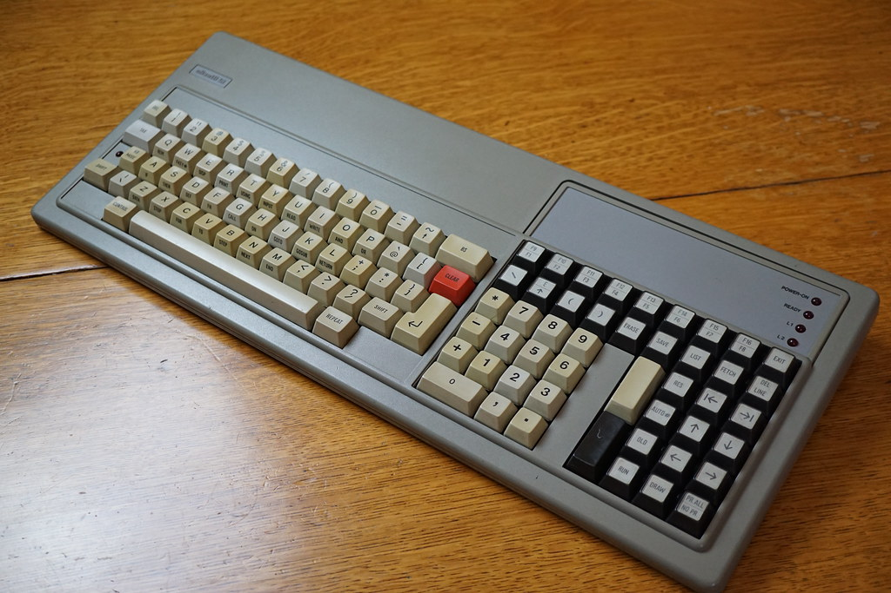
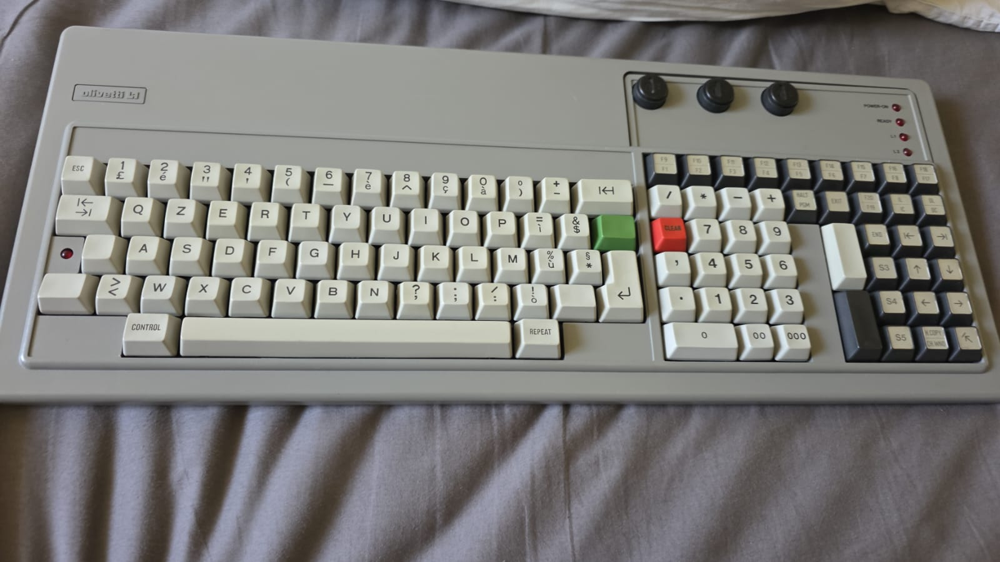

# M40 on Windows: configure BCOS II 3.3, boot it, and reach BASIC

Revision: 14 September 2026. Target: the `olivetti_m40` branch of
`https://github.com/tpaxia/mame`, commit `0cf819193f12db100ec37c58a1a7d43617b31d8c`
or a later revision retaining these changes. This is not a guide for an
unmodified upstream MAME release.

## Quick introduction: status bar and controls

Below the M40 screen, the status bar shows **FLOPPY or HD**, the three
keyboard key-switch positions **K1/K2/K3**, and the keyboard indicators
**READY, L1, L2 and SHIFT**. These reflect emulated switch settings and
guest-controlled lamps; READY is not a general "emulator running" light.

With the command lines in this guide, press **Scroll Lock** to enable MAME
UI controls, then **Tab** to open the menu. Under **Machine Configuration**,
set **Console IPL Switch** to **ISL2 - Floppy Disk** or **ISL1 - Hard Disk**;
the bar displays FLOPPY or HD accordingly. Selecting HD does not imply that
hard-disk boot is working. For this walkthrough, use FLOPPY and leave all
three **Key switch** settings at **Normal**. Change switches in the menu,
not by clicking the status bar. After changing the boot selector, reset with
**Shift+F3** while UI controls are enabled, only when no disk write is active.

Use **File Manager** to load or eject floppies. Close the menu and press
**Scroll Lock** again until **UI controls disabled** appears before typing
into BCOS. For BCOS, **keypad Enter** submits commands, **F12** is RUN/retry,
and **left Ctrl+F12** toggles TEST at `/SYS`—**L2 lights when TEST is on**.
The detailed keyboard map and the required timed disk-eject procedure follow.

**Verified endpoint:** the generated LOAD/RUN pair boots to `/SYS`;
CONTROL + RUN enables TEST (L2 lights); `basic` enters `EDIT`.
This was tested on the macOS build. Windows is the next validation target.
**Executing a BASIC program is not yet verified:** see section 8 before typing
a numbered program. The generator walkthrough combines recorded sessions with
the generation manual; the entire sequence has not been replayed end-to-end
on Windows. Record any differing screens rather than assuming a missing step.

## 1. Files and safe working copies

Assume the distribution contains `mame.exe`, the M40 ROMs in `roms`, and
the following images in `flop`. If your dedicated build is called `m40.exe`,
substitute that executable name in every command; the machine argument remains
`m40`.

| Image | Purpose |
|---|---|
| `K02733_BCOS_II_3.3_CONFIGURATOR.imd` | Bootable floppy-only system generator; keep in FD1 during generation |
| `K02741_BCOS_II_3.3_JJKEYB.imd` | National video/keyboard firmware files; insert in FD2 when requested |
| `BCOS_LOAD.imd` | Previously generated LOAD volume; boot this to skip generation |
| `BCOS_RUN.imd` | Previously generated RUN volume; contains BASIC and stays mounted during use |
| `BCOS_EMPTY.imd` | New sector-formatted blank, with no BCOS filesystem/service records |
| `BCOS_EMPTY_CLEAN.imd` | Read-only master of that blank; copy it before use |
| `BCOS_EMPTY_8DSDD_20260910.mfi` | Original **unformatted** blank; archival only, not a generation destination |

The archive at `~/Projects/mame_disks/BCOS` also holds the available original
BCOS `.scp` captures and IMD conversions, including other releases and utilities.
`MEDIA_PROVENANCE.md` records source paths and SHA-256 checksums. Not all those
disks are needed here. Do not mix 5.0 components with this 3.3 procedure.
No SCP existed for our newly created blank; its original is the 32-byte MFI.

Open **Windows Command Prompt (cmd.exe)** in the directory containing MAME.
These are CMD commands, not PowerShell syntax. For a new attempt:

```bat
mkdir work\bcos1
copy /-Y "flop\K02733_BCOS_II_3.3_CONFIGURATOR.imd" "work\bcos1\CONFIG.imd"
copy /-Y "flop\K02741_BCOS_II_3.3_JJKEYB.imd" "work\bcos1\KEYBOARD.imd"
copy /-Y "flop\K02741_BCOS_II_3.3_JJKEYB.imd" "work\bcos1\NEW_LOAD.imd"
copy /-Y "flop\K02741_BCOS_II_3.3_JJKEYB.imd" "work\bcos1\NEW_RUN.imd"
attrib -R "work\bcos1\*.imd"
```

Use a new directory name for another generation attempt. Do not approve
overwriting files from a session you want to preserve.

Why copy the keyboard disk for output? The successful generation used a
disposable copy of this **BCOS-formatted donor**, not an unformatted disk.
The two `NEW_` images initially contain K02741's labels/files and will be
overwritten by the generator. They are not empty volumes at this point.
The new E5-filled `BCOS_EMPTY_CLEAN.imd` has valid sectors but **has not been
accepted by the generator in a test**. Keep that experiment separate from
this reproducibility path. The original sectorless MFI produced ERR.510.

## 2. MAME UI controls versus keys sent to BCOS

Every launch below explicitly uses:

```text
-noreadconfig -noui_active -uimodekey SCRLOCK -nonatural
```

`-noreadconfig` avoids inherited INI options (including the old F12 UI toggle).
The separate `-cfg_directory` isolates saved input/switch settings. Start with
a new working directory if existing CFG files have custom bindings.
`-nonatural` selects the emulated physical keyboard, not character injection.

**For normal BCOS typing, leave UI controls disabled.**

1. Press **Scroll Lock** once. Look for **UI controls enabled**.
2. Press **Tab** to open the MAME menu.
3. Use PC arrow keys and **main Enter** to operate that menu.
4. Close the menu with Tab, or Escape through its submenus.
5. Press **Scroll Lock** once. Confirm **UI controls disabled** before typing
   into BCOS. This is sometimes called full keyboard emulation mode.

If the popup shows the opposite state, toggle again; use the displayed state,
not a blind count of key presses. Never bind the UI toggle to F12 for this guide.
With UI enabled, F12 is also a MAME speed-control key and F3 resets the machine.
With UI disabled, those keys are available to the emulated keyboard.

To change switches: **Tab → Machine Configuration**. Set **Console IPL
Switch → ISL2 - Floppy Disk**. The status strip must show **FLOPPY**, not HD.
Leave **Key switch 1, 2 and 3 = Normal**. The strip is an indicator; change
these settings in the menu, not by clicking the text. After changing IPL for
a fresh boot, close the menu while leaving UI enabled and press **Shift+F3**
(Reset Machine), then disable UI controls again. Do not reset during disk writes.

To manage disks: **Tab → File Manager → the relevant floppy**. Choose an
image, and **Read-write** if asked when loading a working/output copy. Choose
**Read-only** for source media if desired. Use the empty-slot/unload entry
to eject. Do not use MAME's Create option to generate a fresh sectorless blank.

| MAME image name | BCOS drive | Controller unit (not the drive name to type) |
|---|---|---|
| flop1 | FD1 | 1 |
| flop2 | FD2 | 2 |
| flop3 | FD3 | 3 |
| flop4 | FD4 | 0 |

The driver exposes all four connectors. This walkthrough uses only FD1 and FD2.
**FD0 is not valid.** If a menu shows full device tags, `fdc:1` is FD1 and
`fdc:2` is FD2; `fdc:0` is FD4.

### Required disk-change procedure

For every swap, especially LOAD → RUN:

1. Enable UI, open File Manager, and **eject** the old image.
2. Close the menu and disable UI. Let the machine run with the drive empty
   for **at least two seconds at normal speed**.
3. Re-enable UI, open File Manager and insert the new image into the same drive.
4. Close the menu, disable UI, and allow about **three seconds** before
   acknowledging the BCOS prompt.

Waiting in a paused menu does not count. A direct file replacement can hide
the READY transition from the emulated floppy controller and cause ERR.006.
Do not relabel RUN as LOAD to work around that error.

## 3. Keyboard: exact PC keys to use

The current driver is a QWERTY positional mapping based on the diagnostic
tables. The photographed ANK1402 is QZERTY; **do not type QZERTY on your PC**.
Its MCU sends positional codes, while BCOS translates them using a national
table. Photographs establish the specimen's keycap legends, not fixed software
functions. The ANK1426 photograph is QWERTY/BASIC-labelled, but not identical
to a modern US PC punctuation layout.





Codes below are hexadecimal and refer to what the current driver sends.
The important distinction is **main Enter versus keypad Enter**.

| PC key / action | ANK code / pictured key | Use in this walkthrough |
|---|---|---|
| A–Z | QWERTY positional letter codes | Type command names normally |
| Shift + letter | SHIFT make 6E, break 76 | Uppercase menu answers and password; release Shift before keypad digits |
| Keypad 0–9 | 67, 5F, 60, 5D, 57, 58, 55, 4F, 50, 4D | Date, menu numbers and digits in drive names |
| **Keypad Enter** | **61**, lower tall keypad bar | Submit fields and `/SYS` commands |
| **Main Enter** | **35**, alpha Return | Acknowledge `AFTER ANY KEY : GO` and misleading `Press S bar` prompt |
| **Keypad `*`** | **49**; ANK1402 red CLEAR, ANK1426 keypad `*` | Clear BCOS keyboard E/KE; also verified for SYS error recovery |
| **F12** | **5A**, pictured F8/F16 key | BCOS RUN/retry; acknowledge the generator's application `*ERROR*` |
| **Left Ctrl + F12** | CONTROL 70/78 + 5A | Toggle TEST at `/SYS`; L2 indicates enabled |
| Backspace | 31, backspace arrow/BS | Not guaranteed to delete a digit in BCOS numeric forms |
| Left / Right arrows | 4A / 3E | Move within a field; remove the initial cursor offset before typing FD2 |
| Right Ctrl | 51; ANK1426 RES, ANK1402 END | **Not** the tested BCOS error-reset key; not CONTROL |
| F9 | 37; ANK1426 red CLEAR, ANK1402 green key | Different from BCOS reset at code49; do not substitute |
| F1–F7 | 44, 46, 63, 5B, 53, 4B, 56 | Pictured F1–F7; Shift gives the upper level |
| F8 | 41; ANK1426 `(` | Displaced by the F12 swap; **not** BCOS RUN now |
| Page Down | 52, upper tall keypad bar | SKIP |
| Home / Page Up | 4C / 3A | Back-tab / forward-tab positions |
| Up / Down | 4E / 3C | Up / Down positions |
| End | 3D; ANK1426 SAVE, ANK1402 EXIT | Driver currently labels this `EXIT (3D)`; photo legend differs |
| Escape | 39; ANK1426 EXIT, ANK1402 F17/F18 | Distinct from code3D; not a universal BCOS reset |
| Delete / Insert | 06 / 48 | ANK1426 DEL / ERASE; not modern PC editing semantics in every BCOS form |
| F10 / F11 | 43 / 02 | ANK1426 E-arrow / KB MODE |
| Space | 12 | Ordinary space; **not** the working acknowledgement of `Press S bar` |

Top-row digits send different positions from keypad digits. They are not
aliases; use the keypad for all numeric entries here. Caps Lock is mapped to
code3F (PR ALL/NO PR), **not a caps-lock modifier**. Num Lock is code65
(the driver labels it keypad 000), and keypad `+` is code68 (00), not addition.
Avoid pressing Num Lock inside BCOS merely to change the PC keypad state.

Remaining special bindings: keypad `-`→59, keypad decimal→62,
keypad `/`→5E (AUTO#/S3), right Alt→42, Print Screen→47,
Pause→5C (FETCH), Menu→3B (DEL LINE), left Alt→40 (DRAW/H.COPY).
Left/right Windows keys, where present, send 66 (OLD/S4) and 64 (RUN/S5).
**Code64's RUN legend is not BCOS's CONTROL+RUN at code5A.** These extra
keys are not needed to reach BASIC on a 102-key keyboard.

Scroll Lock is reserved for the UI in this guide, so its native guest LIST54
binding is not reliably available. This is an explicit UI-key conflict, not an
extra guest alias; do not press it to list a BASIC program. Host punctuation
also follows ANK positions: US `-`→2C, `=`→2B, backtick→2A, `[`→36,
`]`→38, `;`→2F, quote→34, backslash/ISO extra key→0A, `/`→29,
comma→23, period→2D. Character results depend on BCOS's active national table.

The status strip shows **READY, L1, L2, SHIFT**. These are guest-commanded
indicators, not inferred CPU activity. READY need not be lit at `/SYS`.
L2 lights when BCOS sends its TEST-on command. The unidentified fifth output
is hidden. The three rotary switches remain Normal throughout this procedure.

## 4. Start the configurator

From the MAME directory in CMD, enter this as **one line**:

```bat
mame.exe m40 -noreadconfig -rompath roms -ramsize 2048K -flop1 "work\bcos1\CONFIG.imd" -flop2 "work\bcos1\KEYBOARD.imd" -cfg_directory "work\bcos1\cfg" -nvram_directory "work\bcos1\nvram" -window -nomaximize -nomouse -skip_gameinfo -noui_active -uimodekey SCRLOCK -nonatural
```

K02733 alone is sufficient to boot; mounting K02741 at launch is convenient,
not required. Do not specify RAM cards in slots together with `-ramsize`.
No debugger, Lua script, saved state, forced guest flag or keyboard alias is
required. The executable must include the new layout and device changes.

1. Acknowledge MAME's non-working-machine warning if shown. `-skip_gameinfo`
   does not suppress every warning. A splash/warning screen is not BCOS.
2. Set IPL to **ISL2 - Floppy Disk** using section 2, reset if necessary,
   and confirm **FLOPPY** in the strip. Disable UI controls.
3. Wait for `DATE YYMMDD`. First boot can take roughly 90 seconds at normal
   speed; do not type commands into the startup display.
4. Enter `860909` using **keypad digits**, then **keypad Enter**. This is a
   known accepted test date, not today's date.
5. At the bottom-line `SYS` prompt, type `sys`, then **keypad Enter**.
   **Do not press Ctrl+J or an extra Enter first.**
6. At the generator's Continue/Exit choice, enter uppercase **C** using
   Shift+C, release Shift, and press **keypad Enter**.

## 5. Configure and generate two output disks

Select a complete, floppy-only M40 system including BASIC. The March 1983
generation manual describes the stages but explicitly does not enumerate
every interactive field because the screens are intended to be self-explanatory.
The following provides the choices and recorded checkpoints; optional screens
can vary with answers. Do not invent menu numbers for a differently labelled screen.

1. On **SYSTEM ENVIRONMENT CHOICE**, select **COMPLETE SYSTEM = Y**, not
   run-time-only. The complete environment includes program preparation.
   If the run-time-only/debugger field remains editable, select N. Enter an
   uppercase password and record it; use **SPAM** to match the existing test
   disks. Advance/confirm fields with keypad Enter; use the displayed C choice
   to continue. Use Shift for uppercase, not Caps Lock.
2. For hardware/storage choices, keep **M40 / floppy-only (mono FDU)**;
   use the two-drive FD1/FD2 workflow. Do not select HD generation or TOCHD.
   Do not add printer/network options merely because the menu offers them.
3. On language/component selection, include **BASIC** and its editor/program
   preparation support. Keep OCL/system support needed by the generator;
   retain defaults for optional features unless you deliberately need them.
4. Select **USA-ASCII, number 13**, from the national keyboard list—not
   INTERNATIONAL 11 or USA-OCA 14. Enter 13 on the keypad and submit with
   keypad Enter.
5. When asked for a disk containing national keyboard files on a drive other
   than FD1, mount `KEYBOARD.imd` in **flop2**. It is K02741/JJKEYB.
   In BCOS enter **FD2**: Shift+F, Shift+D, release Shift, keypad2,
   keypad Enter. If the cursor is one character to the right at field entry,
   press **Left once before typing**; inspect the field for a leading blank.
   FD1 would find the configurator K02733, not the keyboard library.
6. Confirm the offered volume/selection when requested. Wait for
   **Firmware file copied**. At **Press S bar**, press **main Enter**, not
   Space. If Space caused KE, press keypad `*` once, then main Enter.
7. At **Dismount firmware files diskette**, eject FD2 using the timed procedure
   in section 2. Keep CONFIG/K02733 mounted in FD1.
8. For the **first output / LOAD-TIME DISK**, mount `NEW_LOAD.imd` in FD2
   **read-write**. Enter **DRIVE NAME FD2**, **VOLUME CODE LOAD**, and an
   owner identifier such as **TP**. Confirm and wait for generation/verification
   to finish. The disposable donor initially says K02741; authorize overwriting
   only this working copy, never the original keyboard image.
9. When the generator requests the **RUN-TIME output disk**, eject NEW_LOAD,
   let the empty drive run, then insert the separate `NEW_RUN.imd` in FD2
   read-write. Give it **VOLUME CODE RUN** and the same chosen owner. Continue
   until the generator reports completion. Preserve CONFIG in FD1 whenever
   the generator still needs its source libraries.
10. Exit normally using the displayed Exit option. If you need to close MAME,
    enable UI first and use its exit control; do not interrupt an active write.

The generated LOAD contains resident initialization/configuration and selected
firmware; RUN contains transient software, interpreters/editors and must remain
online. **Copying or renaming LOAD to RUN does not generate RUN.** Generate both
outputs through their respective stages.

`NEW_LOAD.imd` and `NEW_RUN.imd` are host filenames. `LOAD` and `RUN` are BCOS
volume codes written by the generator. `FD2` is a drive name; `TP` is an owner.
Renaming a host file changes none of the other three. Do not erase earlier
working outputs until the newly generated pair passes the following boot test.

## 6. Boot the newly generated LOAD/RUN pair

Start a fresh session, not an old save state:

```bat
mame.exe m40 -noreadconfig -rompath roms -ramsize 2048K -flop1 "work\bcos1\NEW_LOAD.imd" -cfg_directory "work\bcos1\bootcfg" -nvram_directory "work\bcos1\bootnvram" -window -nomaximize -nomouse -skip_gameinfo -noui_active -uimodekey SCRLOCK -nonatural
```

1. Check/set **FLOPPY** IPL, reset if needed, leave K1/K2/K3 Normal and
   disable UI controls. Wait for BCOS to finish loading.
2. At **DISMOUNT LOAD-TIME DISK / MOUNT RUN-TIME DISK**, eject **flop1**,
   return to running emulation for at least two seconds, then mount
   `NEW_RUN.imd` in **flop1**, not flop2. Wait about three seconds.
3. At **AFTER ANY KEY : GO**, press **main Enter**.
4. Enter your configured password in uppercase using Shift+letters, then
   **keypad Enter**. For the supplied generated disks it is **SPAM**.
5. Enter date `860909` using keypad digits, then keypad Enter.
6. Expect **`/SYS`**. Leave RUN in FD1. Do not put LOAD back merely because
   an application encounters an error.

### Alternative: test the supplied generated pair first

This bypasses generation and isolates Windows/emulator input from generator choices:

```bat
mkdir work\bcos_ready
copy /-Y "flop\BCOS_LOAD.imd" "work\bcos_ready\LOAD.imd"
copy /-Y "flop\BCOS_RUN.imd" "work\bcos_ready\RUN.imd"
attrib -R "work\bcos_ready\*.imd"
mame.exe m40 -noreadconfig -rompath roms -ramsize 2048K -flop1 "work\bcos_ready\LOAD.imd" -cfg_directory "work\bcos_ready\cfg" -nvram_directory "work\bcos_ready\nvram" -window -nomaximize -nomouse -skip_gameinfo -noui_active -uimodekey SCRLOCK -nonatural
```

Follow steps 1–6 above, swapping to `work\bcos_ready\RUN.imd`, password SPAM.
This pair has already reached `/SYS` and BASIC's EDIT screen in testing.

## 7. Enter BASIC: the verified endpoint

At `/SYS`, with RUN still in FD1 and **UI controls disabled**:

1. Hold **left Ctrl**.
2. Tap **F12**, then release left Ctrl.
3. Confirm **L2 lights** in the status strip. Do not repeat the chord if it is
   already on: it toggles TEST off again.
4. Type `basic` on the letter keys, then **keypad Enter**.
5. Expect **EDIT** at the top left. This is the actual observed BCOS endpoint,
   not a Microsoft-style `OK` prompt.

The error reference defines SYS ERR.163 as TEST presetting not active. The
BCOS manual specifies CONTROL+RUN and L2. We traced the real flag and keyboard
LED command; no RAM patches or artificial LED override were needed.
Neither changing the rotary switches nor pressing the separate RUN/S5 key
(right Windows/code64) substitutes for this chord.

## 8. Simple BASIC program: current limitation and next test

Do **not** describe a program as successfully executed just because EDIT appeared.
On 14 September, disposable tests entered these conventional lines with keypad
digits and keypad Enter:

```basic
10 PRINT 123
20 END
RUN
```

The first line produced **EDIT-ERR.206**; both lowercase and uppercase PRINT
were tested. Subsequent lines did not establish execution. No `123` result
was obtained. Therefore this is a **failed smoke test**, not a working recipe.

The available *L1 MOS BASIC Language User Guide* documents a different command
environment with an `OK` prompt, so importing its numbered-line entry rules
into BCOS's `EDIT` is not justified. We still need the BCOS editor's correct
program-creation/entry/execute procedure, and the meaning of editor error206.
The March BCOS generation guide refers separately to *Preparazione ed
Esecuzione Programmi*, document **4000100 C**; it is not supplied here.

For the Windows validation, stop at EDIT and capture it with L2 visible first.
If testing program entry, record the exact key sequence and the first error;
do not repeatedly press Enter or claim a keyboard/emulation fault from that
error alone. A successful final test will enter a tiny program, execute it,
and visibly display 123; that milestone is still open.

## 9. Recovery and useful checkpoints

| Symptom | Action / interpretation |
|---|---|
| Tab types into BCOS instead of opening a menu | Enable UI with Scroll Lock, check popup, then Tab |
| Ctrl+F12 does not light L2 | Check UI is disabled, left Ctrl is used, window has focus, and `F16/F8 (5A)` is bound to F12 under Input Settings → Input Assignments (this system); do not change rotary switches |
| KE / E at bottom left | Press keypad `*` once; it clears the keyboard error, not necessarily the application's separate error |
| Generator `*ERROR*` after lowercase c | Clear KE if present; press F12 alone to acknowledge application error; then Shift+C and keypad Enter |
| SYS ERR.152 after empty Enter | Syntax/input error, not MAME crash; keypad `*`, then type the intended command and keypad Enter |
| FD0 gives ERROR | Invalid BCOS drive; use FD1 or FD2 according to purpose |
| FD2 missing label | Check the mounted image, write/read mode and timed media change; the E5 blank has no label by design |
| SYS ERR.510 with the old MFI | It is unformatted; use the disposable formatted-donor procedure |
| SYS ERR.006 after LOAD→RUN | Repeat a fresh boot with a real eject/empty interval; do not patch labels or reuse the failed saved state |
| SYS ERR.163 on BASIC | TEST is off; recover the error, then enable TEST and confirm L2 |
| SYS ERR.153 on PRGDIR/CONF2 | Those programs are not on the supplied RUN; not needed for this walkthrough |
| EDIT-ERR.206 after `10 PRINT 123` | Observed program-entry failure; unresolved, distinct from reaching BASIC successfully |

Please record these Windows milestones: commit/executable used; FLOPPY status;
configurator date and SYS; complete-system choices; USA-ASCII13 copied; LOAD
generation completed; RUN generation completed; fresh boot to `/SYS`; Ctrl+F12
lights L2; `basic` reaches EDIT; any program-entry/result screen.

## Sources and evidence

- Current `src/devices/bus/olivetti_l1/keyboard.cpp`, `go252.cpp`, `go280.cpp`,
  `src/mame/layout/m40.lay`; MAME UI implementation and default input definitions
  checked in the same source tree. These establish current bindings, image order,
  UI controls and indicators, not success on Windows.
- Keyboard photographs reproduced above: project ANK1402 folder and ANK1426
  photo set. Positional codes cross-checked with KEYTE1 diagnostic grids and
  recovered ANK1402 8049 firmware; custom legends remain possible.
- *BCOS II*, March 1983 generation manual (`bcosII Agg Marzo 83.pdf`),
  printed §§1.7–1.8, 2.2, 2.5, 2.9–2.13: complete environment, password,
  two-drive workflow, firmware source, distinct LOAD/RUN outputs and generation flow.
- `000-040-corrected.pdf`, PDF pages35 and40: SYS errors152/163 and
  CONTROL+RUN/L2. This reference does not establish EDIT-ERR.206's meaning.
- Project `BCOS_BOOT.md`, `ANK1402_KEYMAP.md` and
  `re/BCOS_TEST_mode_and_keyboard_LEDs.md`: detailed historical evidence.
  **This guide supersedes their old F8/UI-key and pre-reorder drive instructions.**
- Runs `bcos-generated-boot.HpSmLA`, `bcos-run-error.wY4bZG` and
  `bcos-run-error.wfNCMz`: fresh boot, TEST-on/EDIT and TEST-off/163.
  Runs `bcos-run-error.FaO6Yn` and `bcos-run-error.vIoP54`: lowercase and
  uppercase BASIC smoke tests, both stopping at EDIT-ERR.206. Test input used
  ordinary emulated keys on copied media, with no guest code/data modification.
