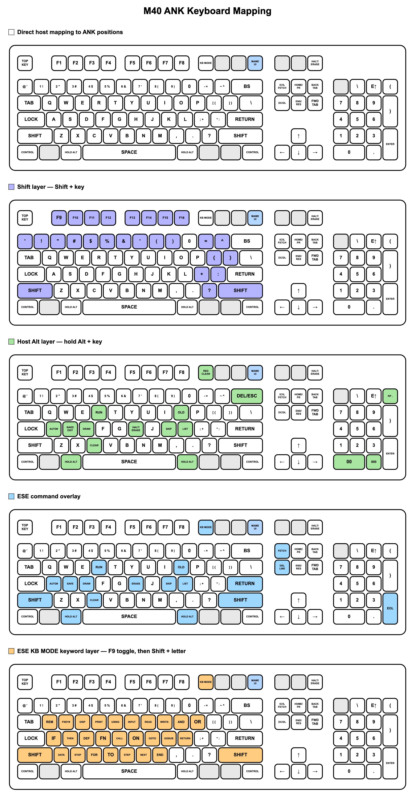

# US keyboard to M40 ANK keyboard mapping

<!-- copyright-holders: Salvatore Paxia -->

This is the user-facing keyboard map for the Olivetti M40 ANK keyboard in
MAME. ESE meanings are documented in the
[M40 ESE keyboard overlay](M40_ESE_KEYBOARD.md).

## How to read the maps

- A label on a PC key shows the corresponding M40 ANK key.
- **HOLD ALT** means hold either PC Alt key with the highlighted key. Alt is
  only part of the PC mapping and is not an M40 key.
- **SHIFT** is the actual M40 Shift modifier.
- F9 selects KB MODE.
- F12 opens and closes the MAME UI and does not reach the M40.
- Main Enter is RETURN. Keypad Enter is the separate numeric EOL/ENTER key.

## Function keys

| PC keyboard | M40 action |
|---|---|
| F1–F8 | F1–F8 |
| Shift+F1–F8 | F9–F16 |
| F9 | KB MODE |
| Alt+F9 | Red CLEAR |
| F10, F11 | Unassigned |
| F12 | MAME UI |

## Editing and movement

| PC keyboard | M40 action |
|---|---|
| Escape | Top-right ANK key |
| Insert | IC / IL / FETCH |
| Delete | DC / DL / DEL LINE |
| Home | HOME / PR ALL / NO PR |
| End | END / RES |
| Page Up | Back tab |
| Page Down | Forward tab |
| Arrow keys | Matching cursor direction |
| Pause | HALT PGM / ERASE |

## Host Alt combinations

Hold Alt while pressing the second key.

| PC keyboard | M40 action |
|---|---|
| Alt+F9 | Red CLEAR |
| Alt+L | LIST |
| Alt+S | SAVE / EXIT |
| Alt+O | OLD |
| Alt+R | RUN |
| Alt+D | DRAW / H.COPY |
| Alt+A | AUTO# |
| Alt+K | SKIP |
| Alt+C | CLEAR |
| Alt+H | HALT PGM / ERASE |
| Alt+Backspace | DEL / ESC |
| Alt+keypad minus | Keypad comma/minus |
| Alt+keypad 0 | Keypad 00 |
| Alt+keypad decimal | Keypad 000 |

Unassigned Alt combinations do nothing.