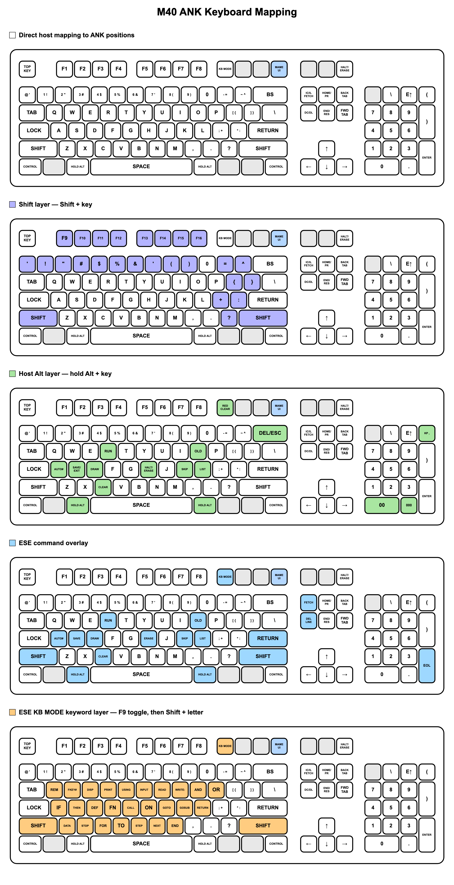
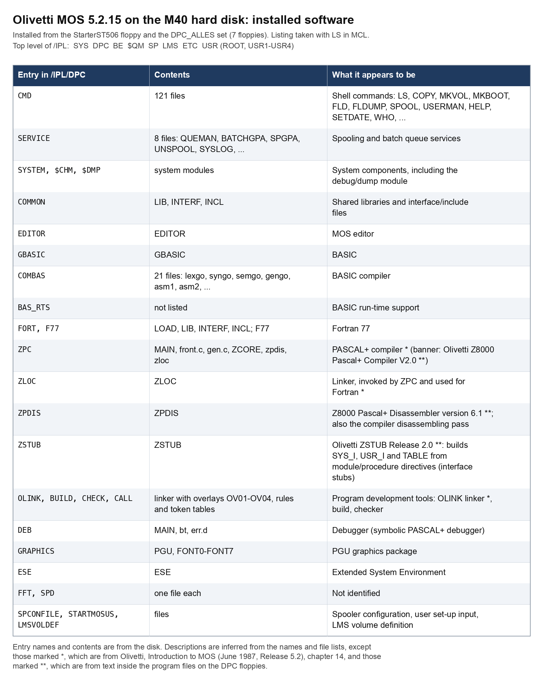
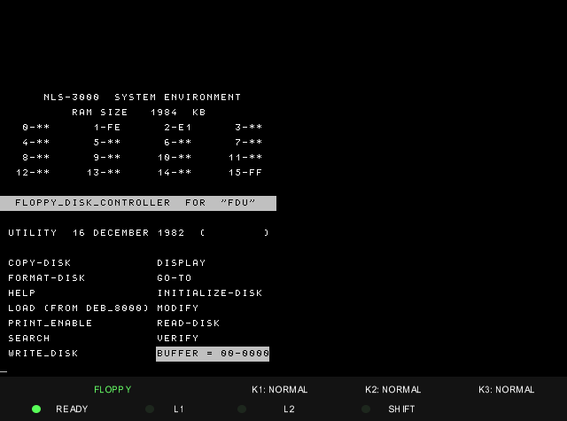

# Olivetti M40 under MAME

Several operating systems run on the emulated Olivetti M40 (L1): ESE, MDOS,
BCOS II from floppy and from the hard disk, and MOS from the hard disk, plus
the DCOS diagnostics and a utility disk. This page has the keyboard maps, one
section per system, and the Windows set-up at the end.

- [Keyboard maps](#keyboard-maps)
- [ESE](#ese)
- [MDOS](#mdos)
- [BCOS II](#bcos-ii)
- [MOS](#mos)
- [DCOS diagnostics](#dcos-diagnostics)
- [Gardini utilities](#gardini-utilities)
- [Images not included](#images-not-included)
- [Windows instructions](#windows-instructions)

The floppy images reached a usable screen or prompt on the M40 in MAME. Run
them from disposable copies if the guest may write to the disk.

## Keyboard maps

The M40 has an ANK keyboard; MAME maps a US PC keyboard onto it.



- [US keyboard to M40 ANK keyboard mapping](M40_KEYBOARD.md): the full
  map, function keys, editing keys and the host Alt combinations.
- [M40 ESE keyboard overlay](M40_ESE_KEYBOARD.md): what the keys mean
  in ESE, including the KB MODE keywords.

The keys that matter in every system:

| PC key | Use |
|---|---|
| Main Enter | RETURN |
| Keypad Enter | The separate numeric EOL/ENTER key; BCOS submits fields with it |
| Keypad digits | Dates and menu numbers in BCOS |
| F1-F8, Shift+F1-F8 | F1-F8, F9-F16 |
| F9 | KB MODE |
| Alt+C | Clear a keyboard error (`E` or `KE` at the bottom left) |
| F12 | Toggle the MAME UI controls; it does not reach the M40 |

In MOS, letters typed without Shift appear as capitals.

## ESE

| Image | Verified result |
|---|---|
| `ESE.IMD` | ESE 3.1 boots to `READY` |

```bat
mame.exe m40 -window -ram 2m -uimodekey F12 -ctrlr m40-ui -flop1 flop\m40\ESE.IMD
```

Use ROM 6.0, 2 MB RAM and the floppy IPL setting. `-uimodekey F12 -ctrlr
m40-ui` makes **F12** the key that turns the MAME UI controls on and off, so
the other keys reach the M40; every command on this page uses it. The key
meanings are in the [ESE keyboard overlay](M40_ESE_KEYBOARD.md).

## MDOS

| Image | Verified result |
|---|---|
| `MDOS30.IMD` | German ESE/MDOS 3.0 boots to `READY` |
| `MDOSUTIL.IMD` | MDOS 3.1 utility system boots to `READY` |

```bat
mame.exe m40 -window -ram 2m -uimodekey F12 -ctrlr m40-ui -flop1 flop\m40\MDOS30.IMD
```

## BCOS II

| Image | Verified result |
|---|---|
| `BCOS_II_3.3_FD_ALL_RESIDENT.imd` | BCOS II 3.3 reaches its mono-user environment |
| `K02733_BCOS_II_3.3_CONFIGURATOR.imd` | BCOS II 3.3 reaches `DATE YYMMDD` and the SYS generator |
| `BCOS_LOAD.imd` | Generated BCOS load-time disk; first half of the verified generated-system boot |
| `BCOS_RUN.imd` | Generated BCOS run-time disk; second half of the verified generated-system boot |
| `K02741_BCOS_II_3.3_JJKEYB.imd` | Keyboard files used during system generation; not bootable on its own |
| `BCOS_EMPTY.imd`, `BCOS_EMPTY_CLEAN.imd`, `BCOS_EMPTY_8DSDD_20260910.mfi` | Blank media for system generation |
| `m40-bcos-hd-kusa.chd` | BCOS II multi-user system on the hard disk; boots to `/SYS` |

### System generation

[BCOS generation](BCOS_GENERATION.md) walks through creating a BCOS II
3.3 system from the configurator disk. The result is the LOAD and RUN pair.

### Generated LOAD/RUN boot

1. Boot `BCOS_LOAD.imd` with the console IPL switch set to floppy.
2. At `DISMOUNT LOAD-TIME DISK / MOUNT RUN-TIME DISK`, eject LOAD.
3. Let emulation run with the drive empty for at least two emulated seconds.
4. Insert `BCOS_RUN.imd` in the same drive.
5. Continue at `AFTER ANY KEY : GO`; the supplied system password is **SPAM** (uppercase), confirmed with keypad Enter.

The empty interval is required so the emulated floppy controller observes the
media change. Directly replacing LOAD with RUN can produce `SYS ERR.006`.

Opening BASIC from `/SYS` is described in the
[Windows quick start](BCOS_WINDOWS_BASIC.md#open-basic).

### BCOS II on the hard disk (WREN2, GO363)

`m40-bcos-hd-kusa.chd` is a 65 MB WREN2 image (1024 cylinders, 9 heads, 32
sectors of 256 bytes) holding the BCOS II multi-user system that the Olivetti
restore procedure installs (JX24, MX24, TOC£, DKC£ of data sets FF and 80).
The only change from that install is the keyboard map: the system was booted
and its configuration changed from `KITA` to `KUSA` with the OSLEM `COS#`
utility (`VARM KUSA` on the keyboard record), so a US keyboard types QWERTY.

It needs the patched MAME branch, the GO363 boot ROM and the control profile
described under [Windows instructions](#windows-instructions).

#### Run BCOS from the hard disk

Work on a copy of the image: the system writes to the disk.

```bat
mame.exe m40 -window -ram 2m -uimodekey F12 -ctrlr m40-ui -rompath roms\m40-hd65 -slot5 go363 -hard1 hard\m40\m40-bcos-hd-kusa.chd
```

1. Dismiss the MAME startup warning.
2. Check the status bar: it must show **HD**. If it shows **FLOPPY**, click it
   to select **HD**, then press F12, Shift+F3, F12 to restart.
3. Wait for the **B.C.O.S. II** banner and `PASSWORD :` (about three minutes
   of machine time).
4. Enter the password **A** (Shift+A), then **keypad Enter**.
5. At `DATE YYMMDD`, type the date with keypad digits (e.g. **860909**) and
   press **keypad Enter**.
6. At `TIME HHMMSS`, type the time with keypad digits (e.g. **120000**) and
   press **keypad Enter**.
7. Wait for **/SYS**.

**F12** toggles the MAME UI controls. Keep them off while typing to BCOS:
press F12 before using Tab or other MAME keys, and F12 again afterwards.
**Alt+C** clears a keyboard error (`E` or `KE` at the bottom left).

## MOS

`m40-mos-hd.chd` is a 65 MB WREN2 image (1024 cylinders, 9 heads, 32 sectors
of 256 bytes) holding Olivetti MOS release 5.2.15. It was installed in MAME
from the `StarterST506` floppy and the seven `DPC_ALLES` floppies, using the
install menu on the starter (SYS_INSTALL, DPC_INSTALL, USR_INSTALL,
CHM_INSTALL, then SHUTDOWN). The kit is a dealer-prepared one, so the install
scripts print German text; MOS itself is in English.

Sectors 0-6 hold the standard Olivetti hard-disk loader (LDHSEL, written by
diagnostic `LDHSE2` on DCOS disk A). It was added after the install rather
than before it; the bytes are the ones the diagnostic writes.

The installed software (the 28 entries of `/IPL/DPC`: shell commands, BASIC,
Fortran 77, the PASCAL+ compiler and its tools, the editor, graphics, ESE)
is listed in this table:



It needs the patched MAME branch, the GO363 boot ROM and the control profile
described under [Windows instructions](#windows-instructions). The branch
carries the bus-arbiter and floppy-DMA fixes that MOS depends on.

### Run MOS from the hard disk

Work on a copy of the image: the system writes to the disk.

```bat
mame.exe m40 -window -ram 2m -uimodekey F12 -ctrlr m40-ui -rompath roms\m40-hd65 -slot5 go363 -hard1 hard\m40\m40-mos-hd.chd
```

1. Dismiss the MAME startup warning.
2. Check the status bar: it must show **HD**. If it shows **FLOPPY**, click it
   to select **HD**, then press F12, Shift+F3, F12 to restart.
3. Wait for `OLIVETTI MOS SYSTEM - REL 5.2.15` and `ENTER USER-NAME :` (about
   three minutes of machine time).
4. Type **root** and press **Enter**. Letters typed without Shift appear as
   capitals, so the screen shows `ROOT`. There is no password.
5. The first login after a boot asks for the date and time. Type the date as
   **MM/DD/YY** with the slashes (e.g. **10/02/87**) and press Enter, then the
   time as **HH/MM/SS** (e.g. **10/30/00**) and press Enter.
6. `ENTER USER-NAME :` comes back. Type **root** and press Enter again.
7. A menu appears. Type **6** and press Enter for **MCL**, the command shell.
   The prompt is `1 ROOT :`; `ls` lists the current directory.

Menu items 2 to 5 are the installer steps and are not needed again. To stop
the system, type **logout** in MCL to return to the menu, choose **7**
(SHUTDOWN), answer the delay prompt (e.g. **5**), and wait for
`SYSTEM IS CLOSED DOWN` before closing MAME.

**F12** toggles the MAME UI controls. Keep them off while typing to MOS.

## DCOS diagnostics

The `diagnostics` directory contains the boot-tested DCOS 8.4 diagnostic set:
`A.IMD` through `H.IMD`, plus `R.IMD`. Each disk boots to the diagnostic
monitor, from which a test program is loaded by its code.

```bat
mame.exe m40 -window -ram 2m -uimodekey F12 -ctrlr m40-ui -flop1 flop\m40\diagnostics\A.IMD
```


The [diagnostics page](diagnostics/README.md) explains how to load and run a
program and lists every program on each disk with its code.

| Disk | Subsystem |
|---|---|
| A | Central unit, RAM, UC |
| B | KDC video-keyboard, MUX |
| C | Line controllers |
| D | FDU, MFDU, STC, MTU |
| E | HDU 18/14 MB |
| F | HDU 60/120 MB Fujitsu SMD |
| G | HDU WREN, Micropolis, ST506 |
| H | HDU 140 MB ESDI |
| R | Reduced 3930 set |

## Gardini utilities

| Image | Verified result |
|---|---|
| `Gardini_Utilities.imd` | Boots to the Gardini NLS3000 utility menu |

```bat
mame.exe m40 -window -ram 2m -uimodekey F12 -ctrlr m40-ui -flop1 flop\m40\Gardini_Utilities.imd
```

The disk is a floppy-disk utility dated 16 December 1982. It shows the
NLS-3000 system environment (RAM size and the board type in each slot) and a
menu of disk functions: COPY-DISK, FORMAT-DISK, INITIALIZE-DISK, READ-DISK,
WRITE_DISK, VERIFY, DISPLAY, MODIFY, SEARCH, GO-TO, LOAD, PRINT_ENABLE and
HELP.



## Images not included

- MDOSC 2.0, 3.1, and 3.2 load but stop or cycle on ERROR 172/173.
- BCOS II 5.0 reaches a system-environment page but no usable prompt.
- The MOS `StarterST506` and `DPC` install floppies are not included; the
  installed system is in `m40-mos-hd.chd`.
- BCOS companion, keyboard, and blank media are not independently bootable.

## Windows instructions

### What it needs

- MAME built from the `m40_z8010_sup_test` branch of
  [tpaxia/mame](https://github.com/tpaxia/mame). The hard-disk systems depend
  on its Z8001, keyboard-port, bus-arbiter and floppy-DMA fixes.
- The M40 ROM 6.0 (`m40rom-6.0.bin`) in MAME's `roms\m40` folder. It is not
  included here. The floppy systems need nothing else.
- For the hard-disk systems only, a ROM that can boot from the GO363. ROM 6.0
  cannot. The experimental ROM is included here as [`roms/m40-hd65/m40/m40rom-6.0.bin`](roms/m40-hd65/m40/m40rom-6.0.bin):
  ROM 6.0 plus a GO363 boot routine. It is not an Olivetti release. Copy the
  whole `m40-hd65` folder into MAME's `roms` folder, giving `roms\m40-hd65\m40\m40rom-6.0.bin`,
  and leave the normal `roms\m40` set as it is. The launch command selects it
  with `-rompath roms\m40-hd65`; MAME warns that the checksum does not match.
- The M40 control profile: copy [m40-ui.cfg](m40-ui.cfg) into MAME's
  `ctrlr` folder.
- The disk images: copy the floppy images into MAME's `flop\m40` folder and
  the `.chd` hard-disk images into `hard\m40`, creating the folders if needed.
- A PC keyboard with a numeric keypad.

Open a Command Prompt in the folder that contains `mame.exe`. If the
executable is called `m40.exe`, use that name in the commands on this page.

### MAME controls

- **F12** toggles the MAME UI controls. Keep them off while typing to the
  M40; press F12 before using Tab or other MAME keys, and F12 again afterwards.
- **Tab** (with the UI controls on) opens the MAME menu, where floppies are
  mounted and ejected.
- The status bar shows **FLOPPY** or **HD**, the IPL source. Click it to
  change it, then press F12, Shift+F3, F12 to restart.

### Step-by-step guides

- [BCOS: Windows quick start](BCOS_WINDOWS_BASIC.md): boot the
  generated system, swap LOAD for RUN, log in and open BASIC.
- [BCOS: istruzioni per Windows](BCOS_WINDOWS_BASIC_IT.md): the same
  in Italian, including system generation.
- [BCOS generation](BCOS_GENERATION.md): create a new BCOS system from the
  configurator disk.
- [Running a diagnostic](diagnostics/README.md#running-a-diagnostic).
- Hard-disk systems: [BCOS II](#run-bcos-from-the-hard-disk) and
  [MOS](#run-mos-from-the-hard-disk) above.
