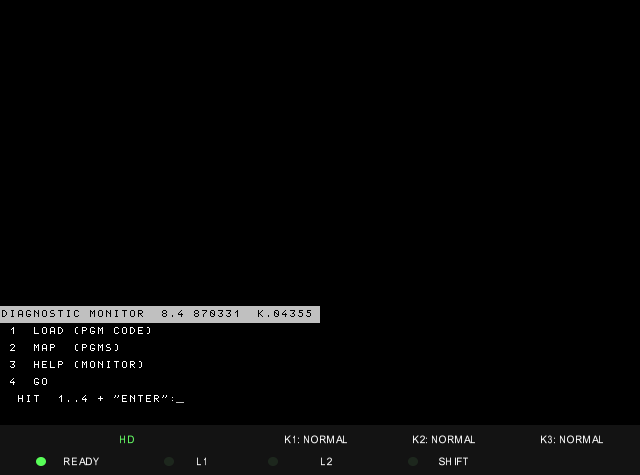
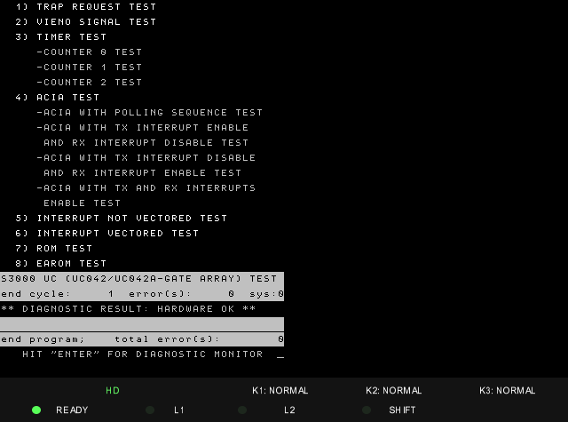

# DCOS 8.4 diagnostic disks for the Olivetti M40

`A.IMD` through `H.IMD` and `R.IMD` are the Olivetti L1 field-diagnostic set
(DCOS 8.4). Each disk boots to the same diagnostic monitor and carries the
test programs for one part of the machine.

| Disk | Subsystem | Programs |
|---|---|---|
| `A.IMD` | central unit / RAM / UC | 23 |
| `B.IMD` | KDC video-keyboard / MUX | 23 |
| `C.IMD` | line controllers | 19 |
| `D.IMD` | FDU / MFDU / STC / MTU | 16 |
| `E.IMD` | HDU 18/14 MB | 15 |
| `F.IMD` | HDU 60/120 MB Fujitsu SMD | 16 |
| `G.IMD` | HDU WREN/Micropolis/ST506 | 13 |
| `H.IMD` | HDU 140 MB ESDI | 9 |
| `R.IMD` | reduced 3930 set | 20 |

## Running a diagnostic

```bat
mame.exe m40 -window -ram 2m -uimodekey F12 -ctrlr m40-ui -flop1 flop\m40\diagnostics\A.IMD
```

1. Boot with the IPL source set to **FLOPPY**. The disk shows the
   `SYSTEM ENVIRONMENT` page (RAM size and the board type in each slot) and
   `HIT "ENTER" FOR DIAGNOSTIC MONITOR`.
2. Press **Enter**. The monitor menu appears:

   

3. Type **1** and Enter (LOAD), then the program code from the tables below as
   three digits and Enter, e.g. **009**.
4. Most programs start by themselves once loaded; otherwise type **4** and
   Enter (GO). Answer the parameter questions (Enter accepts the default),
   then the test-sequence prompt.
5. **2** and Enter (MAP) lists the programs on the disk; **3** is the
   monitor's help.

Example: `UCG304` (disk A, code 009), the test for the UC042 central unit
with the gate array, run with default parameters:



Some programs write to disks. Run them on disposable copies of the images.

## Program catalogues

Generated from the catalogue records on each disk. `Code` is what the
monitor's LOAD asks for; `Rel` and `Date` are the release and date stored
with the program.

### Disk A: central unit / RAM / UC

| Code | Program | Rel | Date | Notes |
|---|---|---|---|---|
| 001 | `UTILY8` | 84 | 871127 | Catalogue loader |
| 002 | `LDHSE2` | 82 | 850612 | Writes the hard-disk loader (LDHSEL) into sectors 0-6 of cylinder 0 |
| 003 | `LDHMU7` | 84 | 871127 |  |
| 004 | `SYSINB` | 84 | 870331 |  |
| 005 | `HDSCT9` | 84 | 870331 |  |
| 006 | `HDMTU7` | 84 | 870331 |  |
| 007 | `HDFDU7` | 84 | 870331 |  |
| 008 | `UC3003` | 83 | 851212 | UC test for boards without the gate array; tests 1-6 pass in MAME, test 7 reports a ROM size fault |
| 009 | `UCG304` | 83 | 851212 | UC042 gate-array UC test; all 8 tests pass in MAME |
| 010 | `UCV305` | 84 | 870331 |  |
| 011 | `UCY805` | 84 | 880222 | UCO.71 multiprocessor UC test; not applicable to the UC042 |
| 012 | `FJCAC1` | 83 | 860616 |  |
| 013 | `WRCAC1` | 83 | 860616 |  |
| 014 | `MEM813` | 84 | 871127 |  |
| 015 | `CHY101` | 84 | 871127 |  |
| 016 | `TCM801` | 84 | 871127 |  |
| 017 | `PRGEN2` | 84 | 880222 |  |
| 018 | `PRT.UC` | 80 | 840810 |  |
| 019 | `PRTWIN` | 80 | 840810 |  |
| 020 | `PRTELB` | 80 | 840810 |  |
| 021 | `PINELB` | 80 | 840810 |  |
| 022 | `SOVRA7` | 81 | 850329 |  |
| 023 | `CESTE0` | 83 | 861117 |  |

### Disk B: KDC video-keyboard / MUX

| Code | Program | Rel | Date | Notes |
|---|---|---|---|---|
| 001 | `UTILY8` | 84 | 870331 | Catalogue loader |
| 002 | `HDFDU7` | 84 | 870331 |  |
| 003 | `UCM805` | 84 | 870331 |  |
| 004 | `CACH84` | 81 | 850329 |  |
| 005 | `TCB805` | 81 | 850329 |  |
| 006 | `MEM813` | 84 | 871127 |  |
| 007 | `MREDA3` | 83 | 851212 |  |
| 008 | `CAC603` | 83 | 851212 |  |
| 009 | `CAC123` | 83 | 851212 |  |
| 010 | `RAMVID` | 80 | 840810 |  |
| 011 | `CRTAN5` | 81 | 841109 |  |
| 012 | `CRTGR2` | 81 | 841109 |  |
| 013 | `KEYTE1` | 83 | 851212 |  |
| 014 | `GRAPH3` | 81 | 850329 |  |
| 015 | `T31103` | 81 | 850329 |  |
| 016 | `TKEY04` | 83 | 851212 |  |
| 017 | `MULT13` | 83 | 860616 |  |
| 018 | `MULT22` | 83 | 851212 |  |
| 019 | `WSVID6` | 84 | 880222 |  |
| 020 | `WSKEY6` | 84 | 880222 |  |
| 021 | `WSPCR3` | 84 | 871127 |  |
| 022 | `WSLIN3` | 84 | 880222 |  |
| 023 | `PRMUX0` | 83 | 860616 |  |

### Disk C: line controllers

| Code | Program | Rel | Date | Notes |
|---|---|---|---|---|
| 001 | `UTILY8` | 84 | 871127 | Catalogue loader |
| 002 | `HDFDU7` | 84 | 870331 |  |
| 003 | `GLAV28` | 83 | 851212 |  |
| 004 | `LCUX26` | 81 | 850329 |  |
| 005 | `TWIN05` | 81 | 850329 |  |
| 006 | `W24D08` | 83 | 861117 |  |
| 007 | `LIONV4` | 81 | 850329 |  |
| 008 | `96ERM6` | 84 | 870331 |  |
| 009 | `96ERS6` | 84 | 870331 |  |
| 010 | `STARL0` | 84 | 870331 |  |
| 011 | `SLANC4` | 84 | 871127 |  |
| 012 | `ER2005` | 81 | 850329 |  |
| 013 | `ERS204` | 84 | 870331 |  |
| 014 | `L2V248` | 83 | 861117 |  |
| 015 | `V24L27` | 83 | 861117 |  |
| 016 | `W24S07` | 83 | 861117 |  |
| 017 | `L9V244` | 83 | 861117 |  |
| 018 | `ETHER2` | 84 | 870331 |  |
| 019 | `ETCOL4` | 84 | 871127 |  |

### Disk D: FDU / MFDU / STC / MTU

| Code | Program | Rel | Date | Notes |
|---|---|---|---|---|
| 001 | `UTILY8` | 84 | 871127 | Catalogue loader |
| 002 | `HDFDU7` | 84 | 870331 |  |
| 003 | `7032E5` | 84 | 870331 |  |
| 004 | `FDUMA2` | 80 | 840810 |  |
| 005 | `4301T4` | 83 | 851212 |  |
| 006 | `4305T6` | 84 | 870331 |  |
| 007 | `6030T6` | 83 | 861117 |  |
| 008 | `SCT303` | 81 | 850329 |  |
| 009 | `STC404` | 84 | 870331 |  |
| 010 | `SCTER7` | 81 | 850329 |  |
| 011 | `EPCOV3` | 81 | 850329 |  |
| 012 | `CPCOV1` | 84 | 870331 |  |
| 013 | `STC5E2` | 83 | 861117 |  |
| 014 | `STC5T3` | 84 | 871127 |  |
| 015 | `MTUER7` | 84 | 870331 |  |
| 016 | `MTC304` | 81 | 850329 |  |

### Disk E: HDU 18/14 MB

| Code | Program | Rel | Date | Notes |
|---|---|---|---|---|
| 001 | `UTILY8` | 84 | 870331 | Catalogue loader |
| 002 | `HDFDU7` | 84 | 870331 |  |
| 003 | `TS5016` | 81 | 841109 |  |
| 004 | `S24I51` | 80 | 840810 |  |
| 005 | `DI5011` | 80 | 840810 |  |
| 006 | `ER50I3` | 80 | 840810 |  |
| 007 | `VC50I2` | 80 | 840810 |  |
| 008 | `50ITM1` | 81 | 850329 |  |
| 009 | `SASIT5` | 83 | 851212 |  |
| 010 | `C50062` | 80 | 840810 |  |
| 011 | `5006F3` | 81 | 841109 |  |
| 012 | `ES3564` | 84 | 870331 |  |
| 013 | `SAS243` | 80 | 840810 |  |
| 014 | `5006V1` | 81 | 850329 |  |
| 015 | `S24X62` | 83 | 851212 |  |

### Disk F: HDU 60/120 MB Fujitsu SMD

| Code | Program | Rel | Date | Notes |
|---|---|---|---|---|
| 001 | `UTILY8` | 84 | 870331 | Catalogue loader |
| 002 | `HDFDU7` | 84 | 870331 |  |
| 003 | `SM23F6` | 82 | 850612 |  |
| 004 | `ST24S5` | 80 | 840810 |  |
| 005 | `2312E8` | 81 | 850329 |  |
| 006 | `SM0611` | 84 | 870331 |  |
| 007 | `SM0609` | 83 | 851212 |  |
| 008 | `F60TM3` | 82 | 850612 |  |
| 009 | `SM12V4` | 83 | 851212 |  |
| 010 | `2322F5` | 82 | 850612 |  |
| 011 | `120ST1` | 83 | 851212 |  |
| 012 | `2322E3` | 81 | 850329 |  |
| 013 | `SM1211` | 84 | 870331 |  |
| 014 | `SM1209` | 83 | 851212 |  |
| 015 | `F12TM3` | 82 | 850612 |  |
| 016 | `SM22V2` | 83 | 851212 |  |

### Disk G: HDU WREN/Micropolis/ST506

| Code | Program | Rel | Date | Notes |
|---|---|---|---|---|
| 001 | `UTILY8` | 84 | 870331 | Catalogue loader |
| 002 | `HDFDU7` | 84 | 870331 |  |
| 003 | `HDC5F5` | 83 | 861117 | Hard-disk format; used to format the WREN2 image |
| 004 | `HDC5E9` | 84 | 870331 | Hard-disk error-rate test |
| 005 | `HDC5V6` | 83 | 861117 |  |
| 006 | `HDC505` | 84 | 870331 |  |
| 007 | `HDC5X3` | 83 | 851212 | ERMAP (defect map) format |
| 008 | `S24W16` | 83 | 851212 |  |
| 009 | `S24W25` | 83 | 851212 | Standard 24 for the WREN2 |
| 010 | `S24M54` | 83 | 851212 |  |
| 011 | `S24X11` | 83 | 860616 |  |
| 012 | `S24WD0` | 83 | 860616 |  |
| 013 | `S24MA1` | 83 | 861117 |  |

### Disk H: HDU 140 MB ESDI

| Code | Program | Rel | Date | Notes |
|---|---|---|---|---|
| 001 | `UTILY8` | 84 | 871127 | Catalogue loader |
| 002 | `HDFDU7` | 84 | 870331 |  |
| 003 | `ESDIF3` | 84 | 871127 |  |
| 004 | `ESDIE1` | 83 | 861117 |  |
| 005 | `ESDIV2` | 84 | 871127 |  |
| 006 | `EIM3S0` | 84 | 871127 |  |
| 007 | `ESDIT1` | 83 | 861117 |  |
| 008 | `EIW3S3` | 83 | 861117 |  |
| 009 | `EIM5S3` | 83 | 861117 |  |

### Disk R: reduced 3930 set

| Code | Program | Rel | Date | Notes |
|---|---|---|---|---|
| 001 | `UTILY8` | 84 | 871127 | Catalogue loader |
| 002 | `LDHSE2` | 82 | 850612 |  |
| 003 | `LDHMU7` | 84 | 871127 |  |
| 004 | `SYSINB` | 84 | 870331 |  |
| 005 | `HDSCT9` | 84 | 870331 |  |
| 006 | `HDFDU7` | 84 | 870331 |  |
| 007 | `UCG304` | 83 | 851212 |  |
| 008 | `UCV305` | 84 | 870331 |  |
| 009 | `UCY805` | 84 | 880222 |  |
| 010 | `UCM805` | 84 | 870331 |  |
| 011 | `MEM813` | 84 | 871127 |  |
| 012 | `PRGEN2` | 84 | 880222 |  |
| 013 | `SCT303` | 81 | 850329 |  |
| 014 | `STC404` | 84 | 870331 |  |
| 015 | `SCTER7` | 81 | 850329 |  |
| 016 | `STC5E2` | 83 | 861117 |  |
| 017 | `STC5T3` | 84 | 871127 |  |
| 018 | `CRTAN5` | 81 | 841109 |  |
| 019 | `KEYTE1` | 83 | 851212 |  |
| 020 | `WSLIN3` | 84 | 880222 |  |
